# Exoplanet-Classification

**Author**: Joshua Gottlieb

## Overview and Business Problem

Using data gathered from NASA's [Cumulative Kepler Objects of Interest Table](https://exoplanetarchive.ipac.caltech.edu/docs/API_kepcandidate_columns.html), the goal was to classify Kepler Objects of Interest (KOI) as confirmed exoplanets or as false positives. Data was retrieved using the [Exoplanet Archive API](https://exoplanetarchive.ipac.caltech.edu/docs/program_interfaces.html#data).

The method used to gather the data is called the *transit method*. Below is an illustration of how the transit method works.

| Transit Method of Detecting Exoplanets |
| :------------------------------------: |
|        |
| [Exoplanet WASP-96 b (NIRISS Transit Light Curve)](https://webbtelescope.org/contents/media/images/2022/032/01G72W1XZK6A79RJK2Z93D58CD?news=true
) |

When a planet passes in front of a star, it reduces the observed light of the star. Based on the amount of reduction in light, as well as many other derived calculations, it is possible to determine whether the object passing in front of the star is a true exoplanet.

For more information about transit methods, here are some articles by [The Planetary Society](https://www.planetary.org/articles/down-in-front-the-transit-photometry-method), [Universe Today](https://www.universetoday.com/137480/what-is-the-transit-method/), and [Dr. Paul Anthony Wilson](https://www.paulanthonywilson.com/exoplanets/exoplanet-detection-techniques/the-exoplanet-transit-method/).

## Data Exploration, Cleaning, and Feature Engineering

A description of column names can be found [here](./data/raw/column_names.md).

After gathering the data, it made sense to split the dataset into two sub-data sets - one for binary classification and one for multi-class classification. The `disposition` column contained `CONFIRMED`, `CANDIDATE`, and `FALSE POSITIVE` values. All records marked `CANDIDATE` were dropped, and a binary classification dataset was created with only values containing `CONFIRMED` and `FALSE POSITIVE` records. However, the dataset also contained 4 false posiive flag columns: `fp_not_transit`, `fp_stellar_eclipse`, `fp_centroid_offset`, `fp_contamination`. Thus, a subset of the binary classification dataset was created using records marked `CONFIRMED` and records marked `FALSE POSITIVE` with exactly one false positive flag set to true, allowing the creation of a multi-class classification dataset.

There were some records with missing values in the dataset, but none of the features had reasonable or obvious imputation options. Thus, records with missing values were dropped from the dataset. The final record count was 5365 for the binary classification dataset and 4260 for the multi-class classification dataset.

For the binary classification, our target variable is `disposition` where the classes are confirmed exoplanet (0) or false positive (1). For the multi-class classification, our target variable is `classification` where the classes are confirmed exoplanet (0), non-transit false positive (1), stellar eclipse false positive (2), centroid offset false positive (3), and contamination false positive (4). After examining the distributions of our features based on these target variables, there are a few features which stand out for their ability to strongly separate between classes.

| Features with Good Separation                       |
| :-------------------------------------------------: |
|        |
| 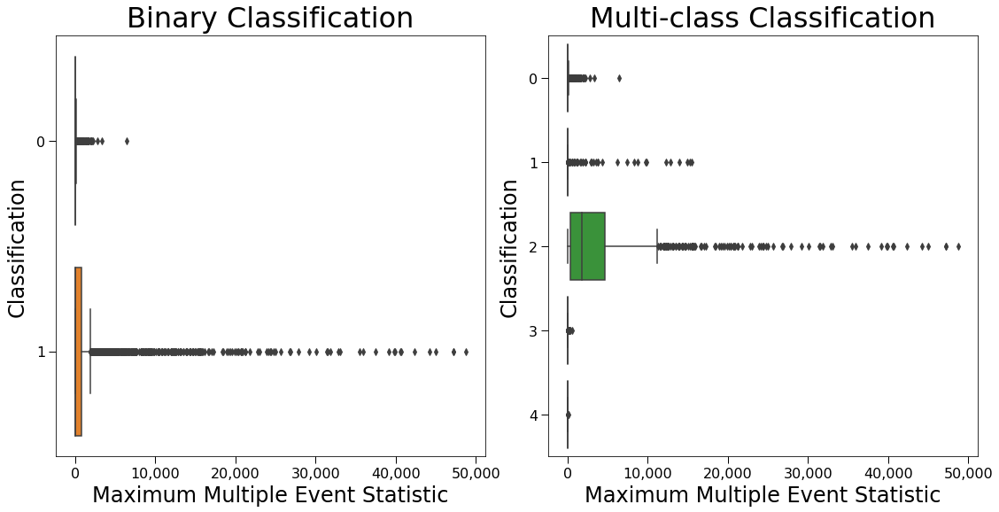     |
|      |
| 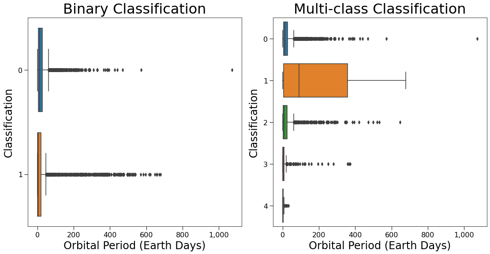           |
| 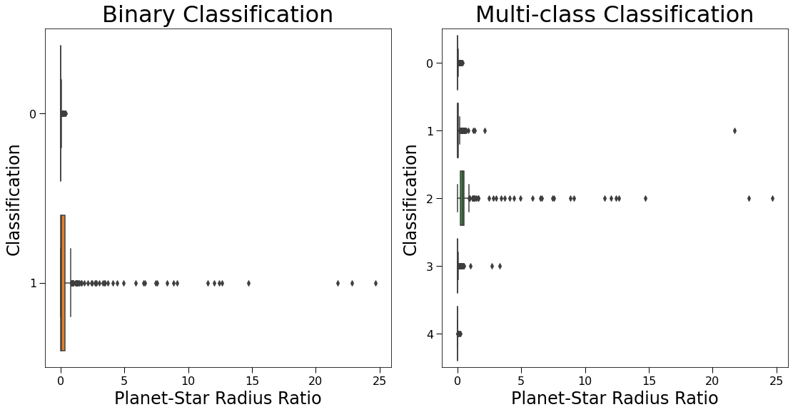 |
|             |

As can be seen above, Maximum Multiple Event Statistic, Planet-Star Radius Ratio, and Transit Depth are strong separators of class 2 false positives, Orbit Semimajor Axis and Orbital period are strong separators of class 1 false positives, and Angular Sky Offset is a strong predictor of class 3 false positives. We would expect these features to be strong contributors to our models, and because these features are good at separating classes, we would expect our models to perform well.

There were not many features that needed to be engineered for this data analysis project. The only features with some level of feature engineering desirable were the features related to stellar wavelength magnitude measurements. There were 4 KIC-band magnitudes measuring the quantity of light within certain frequency bands (the griz frequencies), and 3 2MASS-band magnitudes (the JHK frequencies). Because these magnitudes were relatively similar among records, I decided to create new features representing the absolute differences between each 2-length combination of griz frequences and between each 2-length combination of JHK frequencies. For more information, see the [EDA and Feature Engineering Notebook](./notebooks/EDA-and-Feature-Engineering.ipynb). These engineered features were not very important in the models.

## Results

| Baseline Binary Class Logistic Model           | Final Binary Class XGBoost Model               |
| :--------------------------------------------: | :--------------------------------------------: |
| 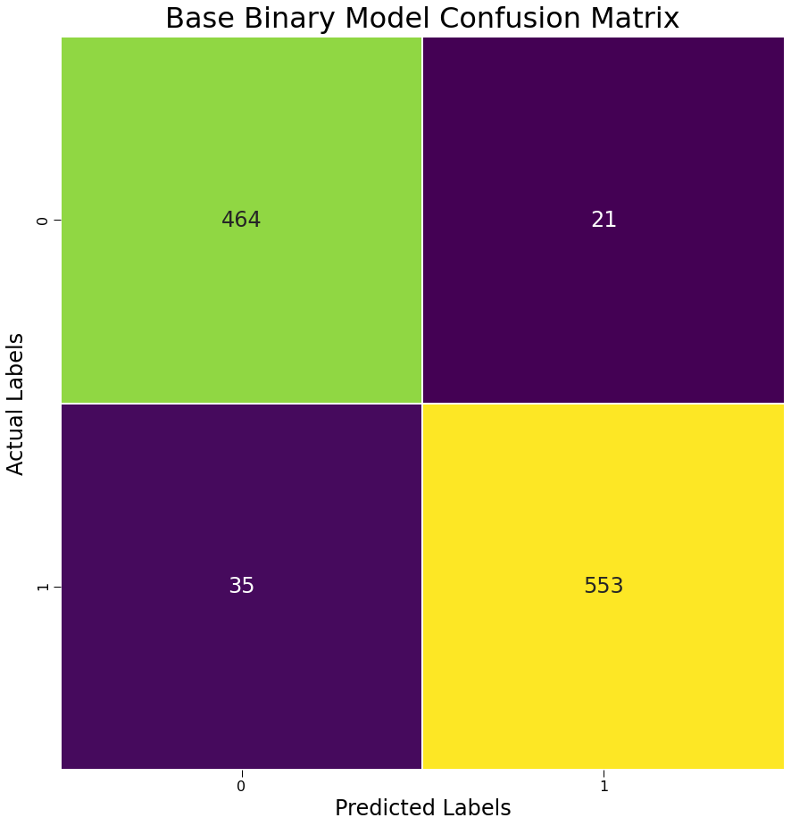 | 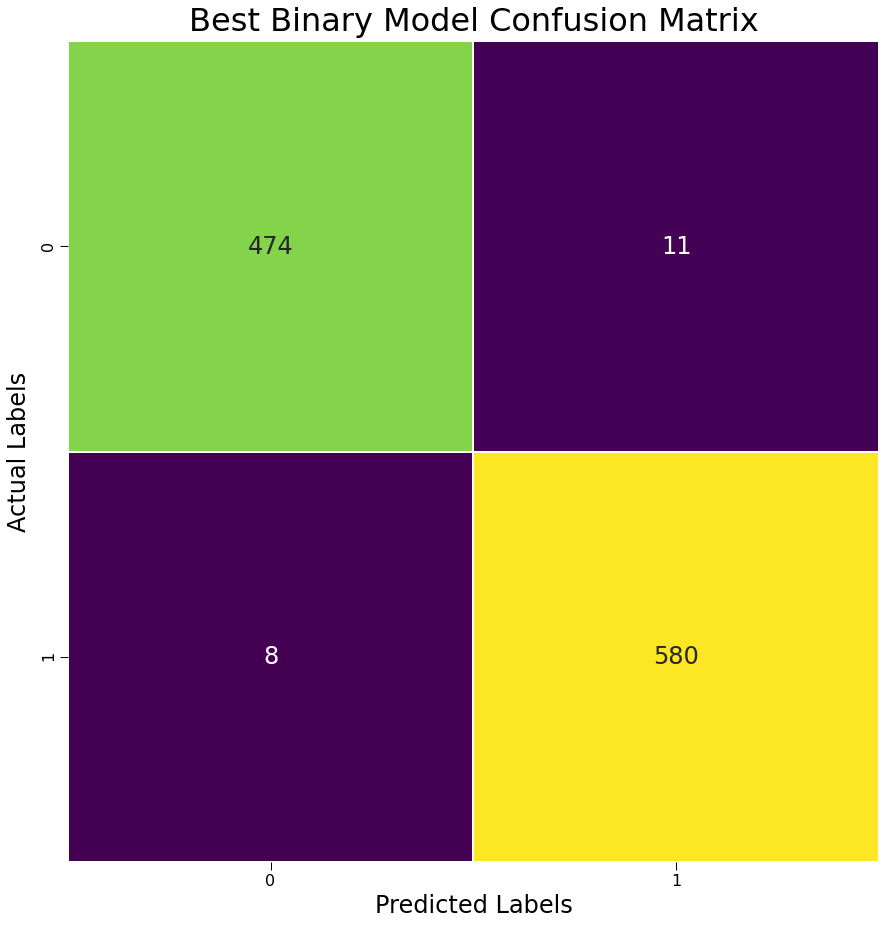 |
|      | 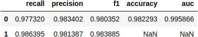     |

As predicted by our Feature Analysis, even a completely untuned logistic model produces a highly accurate model. The final XGBoost model used all default parameters except for having 500 estimators (default 100) and a max tree depth of 12 (default 6).  The XGBoost model significantly improves upon the logistic model, giving an astounding accuracy of 98.2%. There were no issues of class imbalance, as there were 1942 confirmed planets and 2350 false positives in the training dataset. Both of these models were trained with a scoring method of accuracy - technically speaking we are most interested in class 0 (confirmed exoplanet) recall, as we do not want to miss any potential exoplanets, since the purpose of the Kepler missions is to find exoplanets. Another XGBoost model grid search was performed with an emphasis on class 0 recall, but it did not perform any better than the one scored on accuracy. For more information about which grid search parameters were used, see the [Modeling Notebook](./notebooks/Modeling.ipynb).

| Best Binary Classifier Feature Importances by Absolute Magnitude of Coefficient |
| 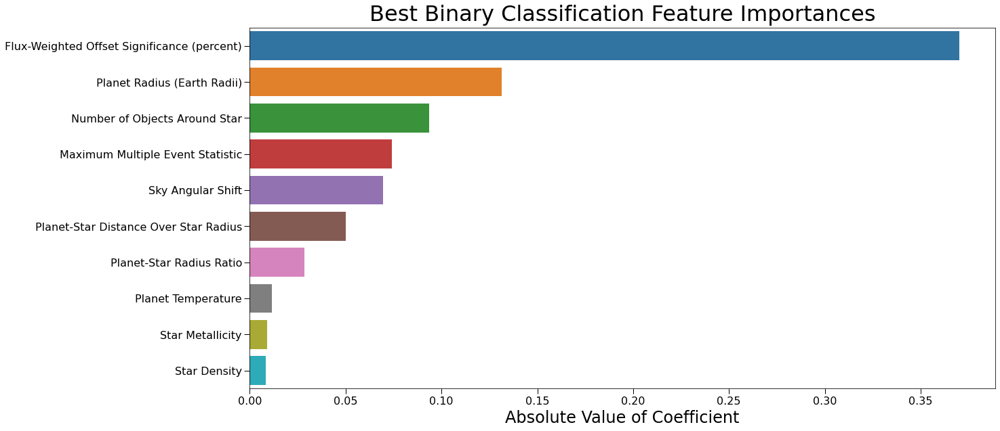                               |

As expected, Maximum Multiple Event Statistic, Planet-Star Radius Ratio, and Sky Angular Offset rank in the top 10 features for our binary classifiers.

| Baseline Multi-Class Decision Tree Model      | Final Multi-Class XGBoost Model               |
| :-------------------------------------------: | :-------------------------------------------: |
| 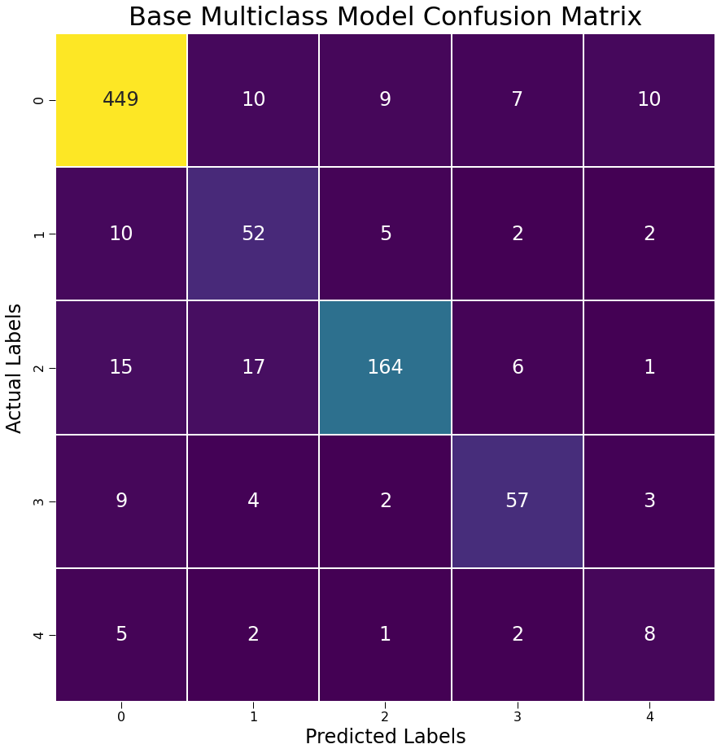 | 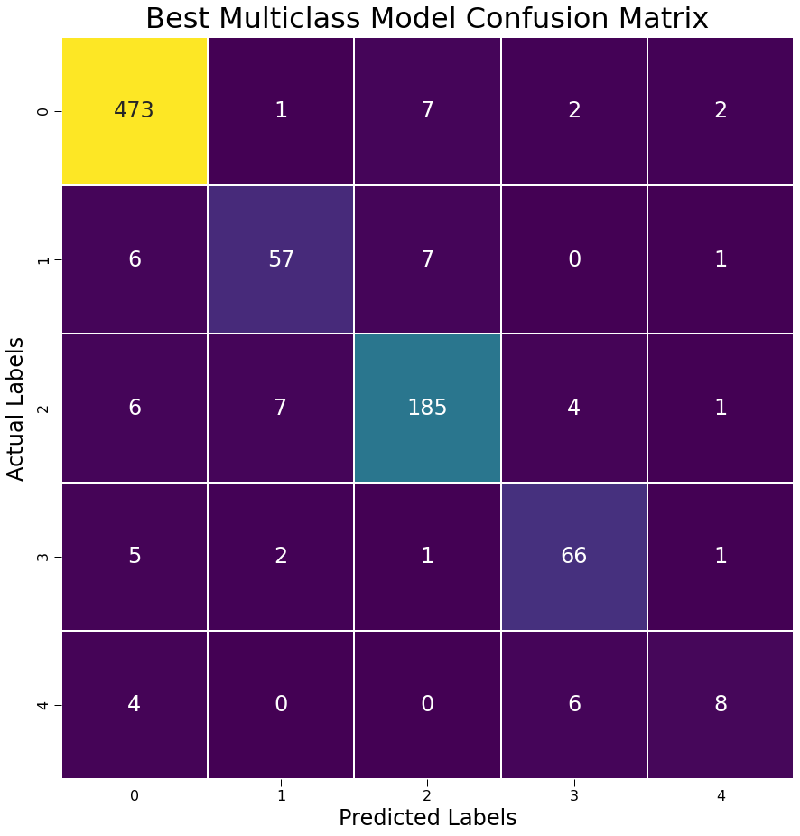 |
| 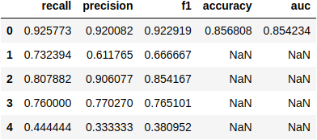     | 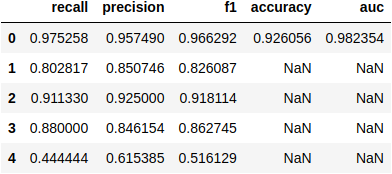     |

Unlike the binary classification subset, the multi-class classification subset is not quite as good at separating between classes. This is partially due to heavy class imbalance, as there were 1942 records of class 0 (confirmed exoplanet), 282 records of class 1 (non-transit false positive), 814 records of class 2 (stellar eclipse false positive), 299 records of class 3 (centroid offset false positive), and only 71 records of class 4 (contamination false positive) in the training dataset. For each of these models, resampling methods were necessary. Due to the extremely low record count for class 4, only SMOTE and RandomOverSampler (both from IMBlearn's over_sampling library) were tested. In most models, RandomOverSampler outperformed SMOTE. The final XGBoost model used all default parameters except for having 1000 estimators (default 100) and only using 50% of the feature by node (default 100%).

Nevertheless, the baseline decision tree model boasts an accuracy of 85.7%, and the final multi-class XGBoost model improves this accuracy up to 92.6%, which are excellent levels by most data analysis standards. Specifically, there is a large increase in precision and recall for class 1 and 3 between the baseline and final multi-class models. There is an increase in precision for class 4, but the recall did not improve between the baseline and multi-class models. This is almost certainly due to the extreme class imbalance for class 4 and likely cannot be fixed without adversely affecting the other class predictions unless more data points are gathered. The final model has an excellent class 0 recall of 97.5%, and it achieved this result without losing precision, which is a good sign that the data is highly separable and that the model is capturing the true relationships between the features and the target.

| Best Multi-Class Classifier Feature Importances by Absolute Magnitude of Coefficient |
| 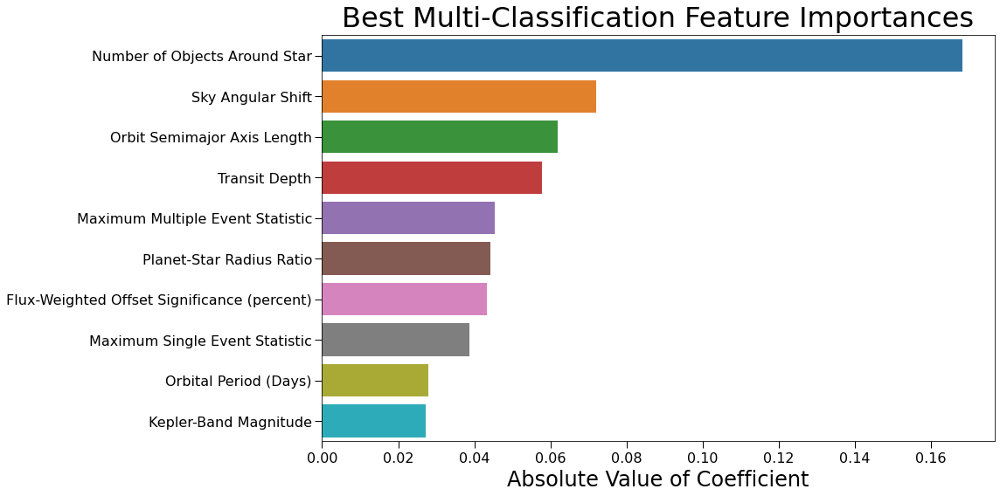                                     |

As expected, all six of the variables inspected earlier during EDA showed up in the most important features of the multi-class classifier. Interestingly, the number of objects identified around the star is the most powerful predictor in this model. This makes intuitive sense, as one would expect that if a star system contains one exoplanet, it is likely to contain more, so the identification of multiple distinct Kepler objects is a strong predictor of whether each object is a planet.

## Conclusions

The KOI dataset contains many features that are specifically engineered for the task of classifying exoplanets. As such, many of the features strongly separate the confirmed exoplanets from the different types of false positives. In particular, the number of Kepler objects identified around a star is the strongest feature for such classification, followed by Sky Angular Shift, Orbit Semimajor Axis Length, Transit Depth, Maximum Multive Event Statistic, and the Planet-Star Radius Ratio.

Through the careful calculation of these statistics, and with the power of machine learning, it is possible to classify exoplanets with a very high degree of accuracy.

## Next Steps

Next steps include:
<ul>
    <li>Try further combinations of hyperparameters to further tune models.</li>
    <li>Try a mixture of oversampling and undersampling techniques to address class imbalance.</li>
    <li>Try stacked and voting classifiers.</li>
</ul>

## For More Information

Please look at my full analysis in [Jupyter Notebooks](./notebooks) or in my [presentation](./presentation/King_County_Linear_Regression_Presentation.pdf).

For any additional questions, please contact: **Joshua Gottlieb (joshuadavidgottlieb@gmail.com)**

## Repository Structure

```
├── README.md                               <- The top-level README for reviewers of this project   
├── .gitignore                              <- Hidden file specifying which files to ignore
├── data                                    <- Folder containing external and code-generated data
│   ├── cleaned                             <- Folder containing cleaned data used by notebooks
│   │   ├── binary_class_data.parquet
│   │   ├── multi_class_data.parquet
│   │   ├── test_binary.parquet
│   │   ├── test_multi.parquet
│   │   ├── train_binary.parquet
│   │   └── train_multi.parquet
│   ├── models                              <- Folder containing pickled fitted models
│   │   ├── binary
│   │   │   ├── binary_adaboost.pickle
│   │   │   ├── binary_base_logistic.pickle
│   │   │   ├── binary_gradientboost.pickle
│   │   │   ├── binary_kneighbors.pickle
│   │   │   ├── binary_logistic.pickle
│   │   │   ├── binary_random_forest.pickle
│   │   │   ├── binary_tree.pickle
│   │   │   ├── binary_xgboost_class_0_recall.pickle
│   │   │   └── binary_xgboost.pickle
│   │   └── multi
│   │       ├── multi_adaboost.pickle
│   │       ├── multi_base_tree.pickle
│   │       ├── multi_gradientboost.pickle
│   │       ├── multi_kneighbors.pickle
│   │       ├── multi_random_forest.pickle
│   │       ├── multi_tree.pickle
│   │       ├── multi_xgboost_class_0_recall.pickle
│   │       └── multi_xgboost.pickle
│   └── raw                                    <- Folder containing raw files used by Data-Cleaning notebook
│       ├── column_names.md
│       ├── kepler_cumulative.csv
│       └── kepler_cumulative.csv.zip
├── notebooks                                  <- Folder containing Jupyter notebooks with project code
│   ├── Data-Cleaning.ipynb
│   ├── Data-Collection.ipynb
│   ├── EDA-and-Feature-Engineering.ipynb
│   ├── Modeling.ipynb
│   ├── packages                               <- Subfolder containing methods used between notebooks
│   │   ├── __init__.py
│   │   ├── model_evaluation.py
│   └── Visualizations.ipynb
├── images                                     <- Folder containing images generated from code and from external sources
│   ├── angular_offset_sky_boxplots.png
│   ├── base_binary_class_report.png
│   ├── base_binary_confusion_matrix.png
│   ├── base_multi_class_report.png
│   ├── base_multi_confusion_matrix.png
│   ├── best_binary_class_report.png
│   ├── best_binary_confusion_matrix.png
│   ├── best_binary_feature_importances.png
│   ├── best_multi_class_report.png
│   ├── best_multi_confusion_matrix.png
│   ├── best_multi_feature_importances.png
│   ├── max_multi_event_stat_boxplots.png
│   ├── orbital_period_boxplots.png
│   ├── orbit_semimajor_axis_boxplots.png
│   ├── planet_star_radius_ratio_boxplots.png
│   ├── transit_depth_boxplots.png
│   └── transit_method.png
├── presentation                               <- Folder containing PDF of presentation
│   └── Identifying_Exoplanets_Using_Machine_Learning.pdf
└── README.md
```